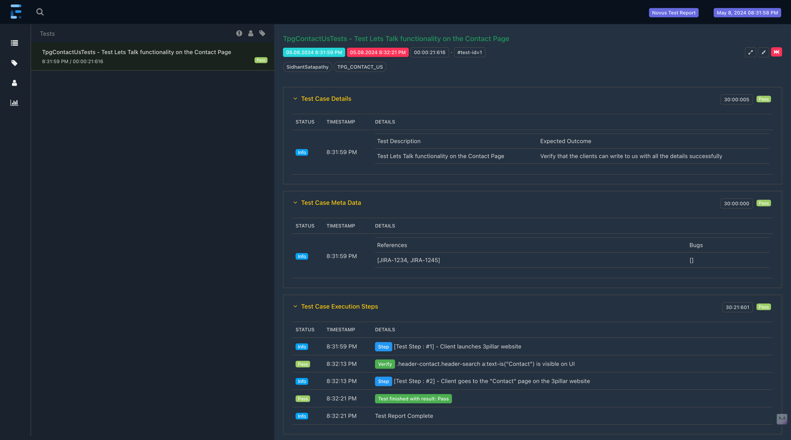
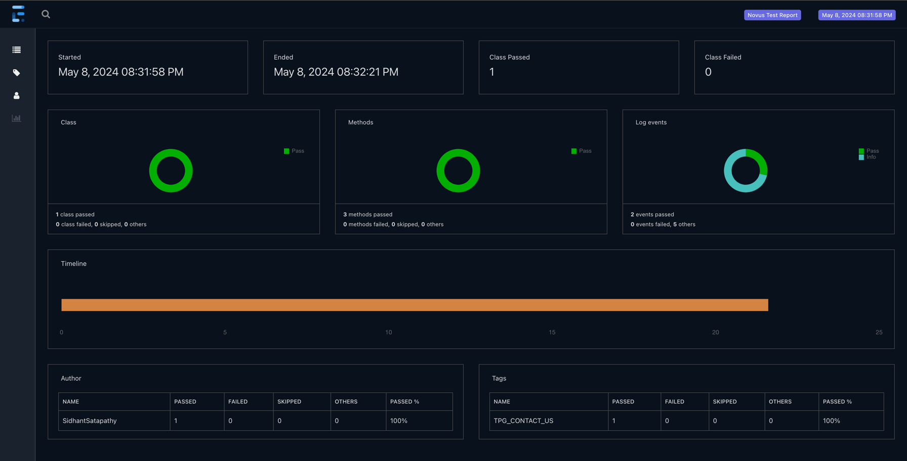

# Project Novus, Modern Automation Framework

**_Novus is a latin word that means new, fresh, young and extraordinary._**

🔥 Novus is a **multi module** java based **TAF** that can be used to write **super stable** and **high quality** automated **acceptance** UI, API and Hybrid test scenarios using the proven Playwright framework.

**Tools Used**

* Spring Boot
* TestNg
* Playwright
* Java
* Maven
* Lombok

## The Novus Style

_"To communicate effectively, the code must be based on the same language used to write the requirements—the same language that the developers speak with each other and with domain experts._
― Eric Evans, "Domain-Driven Design: Tackling Complexity in the Heart of Software"

Novus uses a **DSL** that is extremely readable and easy to write just like simple english sentences.
Novus helps in writing user-centric automated acceptance tests just like how our POs write requirements

<details>
<summary>Test Case Example</summary>

```java
@MetaData(author = "Sidhant Satapathy", testCaseId = "1", stories = {"JIRA-1234", "JIRA-1245"}, category = "TPG_CONTACT_US")
@Description("Test Lets Talk functionality on the Contact Page")
@Outcome("Verify that the clients can write to us with all the details successfully")
@Test
public void testClientWritingToUs() {
    step("Client launches 3pillar website");
    client.attemptsTo(Launch.app(on(urlService.getAppUrl())).withConfigs(pageOptions.getDefaultSetupOptions()));

    step("Client goes to the \"Contact\" page on the 3pillar website");
    client.attemptsTo(
        Navigate.to().contactPage(),
        fillFirstName("Test"),
        fillLastName("User"),
        fillCompanyName("Test Company"),
        fillBizEmail("client@abc.com"),
        fillBizPhoneNumber("1234567890"),
        selectState("Alabama"),
        fillClientMessage("Hi I am testing the Lets Talk Section, Hope you got my email"));
}
```

</details>

☝️ In Novus, **only** an _**Actor**_ has the ability to perform actions on the GUI of the web application.

Actions in Novus will be fluent and will look like plain english sentences, exactly how we document test steps in a Test Plan.

```java
public static Performable fillFirstName(String fName) {
    return Perform.actions(Enter.text(fName).on(ContactPage.LetsTalk.FIRST_NAME)).log("fillFirstName", "fills the first name of the client");
}

public static Performable fillLastName(String lName) {
    return Perform.actions(Enter.text(lName).on(ContactPage.LetsTalk.LAST_NAME)).log("fillLastName", "fills the last name of the client");
}

public static Performable fillCompanyName(String cName) {
    return Perform.actions(Enter.text(cName).on(ContactPage.LetsTalk.COMPANY_NAME)).log("fillCompanyName", "fills the company name of the client");
}

public static Performable fillBizEmail(String bizEmail) {
    return Perform.actions(Enter.text(bizEmail).on(ContactPage.LetsTalk.BIZ_EMAIL)).log("fillBizEmail", "fills the biz email of the client");
}

public static Performable fillBizPhoneNumber(String phNumber) {
    return Perform.actions(Enter.text(phNumber).on(ContactPage.LetsTalk.BIZ_PHONE)).log("fillBizPhoneNumber", "fills the biz phone number of the client");
}

public static Performable fillJobTitle(String jobTitle) {
    return Perform.actions(Enter.text(jobTitle).on(ContactPage.LetsTalk.JOB_TITLE)).log("fillJobTitle", "fills the job title of the client");
}

public static Performable fillClientMessage(String message) {
    return Perform.actions(Enter.text(message).on(ContactPage.LetsTalk.MESSAGE)).log("fillClientMessage", "fills the client's message");
}

public static Performable selectState(String state) {
    return Perform.actions(Select.option(state).on(ContactPage.LetsTalk.LOCATION_DPDWN)).log("selectState", "fills the client's state");
}

```

### How To Write a Test Class

Novus uses Spring Boot to manage profiles which then pick properties based on the configuration.
e.g. browser properties are picked from **_application-web.properties_** and test app properties are picked from **_application-test.properties_**

☝️ **Note** : You need to create a **_application-local.properties_** to override the browser settings so that you can run the browser in the headed mode for debugging on your local machine. Create the file in novus-example-test/test/resources folder
and use the profile in your test classes.

☝️ Please rename them as per your need.

** Your Hybrid/GUI Tests must extend the _**NovusGuiTestBase**_ class

** Your API automated Tests must extend the _**NovusApiTestBase**_ class

** They must include ActiveProfiles **web** and **test** or **local** as needed

```java
@ActiveProfiles({"web", "test", "local"})
public class TpgContactUsTests extends NovusGuiTestBase {
}
```

```java
@ActiveProfiles({"web", "test", "local"})
public class BasicApiTests extends NovusApiTestBase {
}
```

** Rename the module novus-example-tests to novus-yourproductname-tests or novus-yourteamname-tests

☝️ To know how to use different actions in Novus refer to [How To](./novus-example-tests/src/main/resources/HowTo) docs.
☝️ You can write your custom actions by implementing the interface `Performable.java`


## Project Structure

### Where to add your tests

```
__
|  |_src
|    |_test
|      |_java
|        |_com.tpg.productname
|          |_automation
```

### Where to add your pages, impls, macros and common code

```
__
|  |_src
|    |_main
|      |_java
|        |_com.tpg.productname
|          |_automation
|            |_web
|              |_product
|                |_impls
|                |_macros
|                |_pages
|                |_common
```

### Where will your screenshots and Html reports and other test related files be created?

```
__
|  |_src
|    |_test
|      |_resources
|        |_screenshots
|        |_reports
|        |_testfiles
```
## Reports, Screenshots and Suite Files
- Novus generates the Screenshots for only the failed tests in the `novus-example-tests/src/test/resources/screenshots` folder
- Novus generates the Spark Reports in the `novus-example-tests/src/test/resources/reports/date-wise-folder` folder
- Ideally you should put your suite.xml files in the `novus-example-tests` module
- You can control the report's name in the [test properties](./novus-example-tests/src/test/resources/application-test.properties)




### For contributing to this repo please check the [contributing rules](CONTRIBUTING.md)

#### Now that we are ready with the basics let's roll
```
mvn clean test -DsuiteXmlFile=yoursuitefile.xml
```
